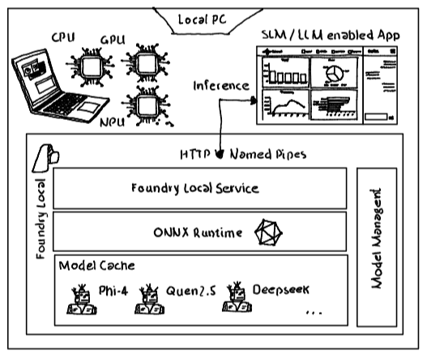

# Foundry Local 

## Intro 

In certain applications, executing AI models locally—on devices equipped with an NPU, GPU, or even a standard CPU—is essential for ensuring optimal performance, preserving bandwidth, and addressing privacy or security concerns. 

Historically, running AI models locally has been made possible through frameworks like [ONNX](https://onnxruntime.ai/) for cross-platform model optimization and deployment, or tools like [Ollama](https://ollama.com/) that simplify managing and executing large language models on local machines. [Microsoft Foundry Local](https://learn.microsoft.com/en-us/azure/ai-foundry/foundry-local/get-started) further streamlines the process, offering a straightforward and developer-friendly way to run powerful AI workloads locally. 

## Foundry Local

The Foundry Local architecture by Microsoft enables secure, low-latency, and offline-capable AI model inference on local devices, such as laptops and servers. Designed with flexibility and scalability in mind, it supports diverse hardware configurations (CPUs, GPUs, NPUs) and allows developers to integrate AI models directly into applications without relying on constant cloud connectivity. Key benefits include improved data privacy, cost savings, seamless development integration, and support for running in disconnected environments. Additionally, Foundry Local provides an Azure OpenAI-compatible endpoint for inference, enabling developers to use familiar APIs while maintaining full control over local model execution.

The system is built around several core components: an OpenAI-compatible REST API, ONNX Runtime for executing models across various hardware, a local model cache, and tools for model lifecycle management (download, load, run, unload, delete). Foundry Local also includes developer-friendly interfaces like a command-line interface, SDKs for common programming languages, and Visual Studio Code integration via the AI Toolkit. Before deployment, models must be compiled into ONNX format using the Olive optimization tool to ensure high performance on edge devices.

## Install & Configure Foundry Local

The [Powershell Script](./setup/setup.ps1) performs the following actions:
- Installation of Foundry Local using winget (Windows) or brew (Mac)
- Download of the correct phi-4-mini-reasoning model from Azure AI Foundry (depending on the available hardware )
- Load of the phi-4-mini-reasoning model within Foundry Local
- Retrieve Foundry Local inference endpoint for the loaded phi-4-mini-reasoning model
- Creates and stores model uri and model id in [configuration file](./config/config.env)

## Sample Inference

The provided [Polyglot Notebook - Completion.ipynb](./src/Completion.ipynb) utilizes the Azure OpenAI SDK to interact with a Phi-4-mini-reasoning model served by Foundry local.

Foundry local exposes this model through an HTTP endpoint, which the SDK can access to send prompts and receive responses, enabling seamless local inference within the demo code.

